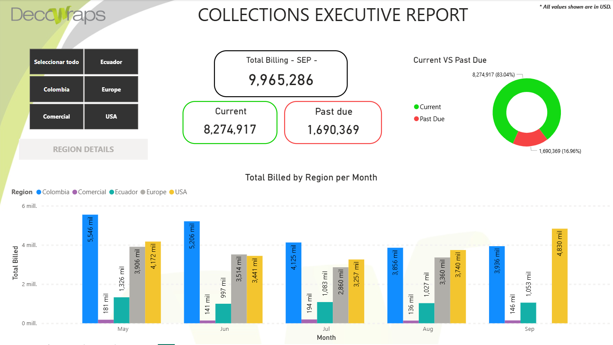
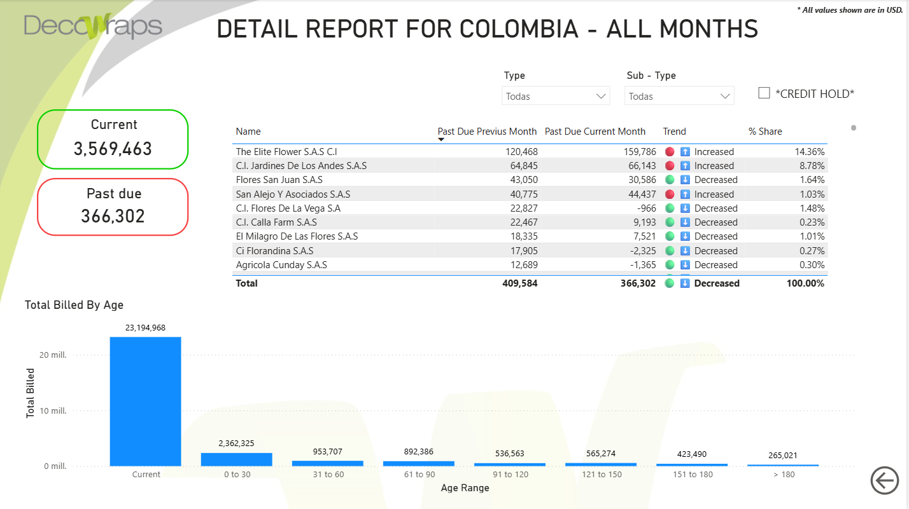

# 📊 Collections Executive Report (Power BI)

Este repositorio contiene un **Dashboard de Control Estratégico** diseñado para la gestión y optimización de las Cuentas por Cobrar (*Accounts Receivable*) y el flujo de caja. La herramienta permite a los niveles ejecutivos y equipos de cobranza identificar cuellos de botella en el recaudo, priorizar clientes de alto riesgo y monitorear la eficiencia operativa del departamento financiero.

---

## 🎯 Impacto de Negocio

La implementación de este reporte permite:
* **Optimizar el DSO (Days Sales Outstanding):** Identificación visual de tendencias de retraso en los pagos.
* **Reducción de Bad Debt:** Alerta temprana sobre facturas que entran en rangos de mora crítica (90+ días).
* **Eficiencia en Cobranza:** Priorización de clientes basada en el monto adeudado y días de vencimiento.

---

## 🚀 Funcionalidades y Vistas Clave

### 1. Executive Summary (Overview)
Una visión de alto nivel con los indicadores financieros más importantes:
* **Total Accounts Receivable:** Monto total pendiente por cobrar.
* **Collection Efficiency Index (CEI):** Porcentaje de recaudo real vs. el proyectado.
* **DSO Actual vs. Objetivo:** Seguimiento del tiempo promedio de cobro.



### 2. Aging Buckets Analysis
Segmentación detallada de la cartera por antigüedad:
* Análisis por rangos: Current, 1-30, 31-60, 61-90 y +90 días.
* Capacidad de *Drill-down* para ver qué facturas específicas componen cada rango de riesgo.



### 3. Regional & Customer Performance
* Mapas interactivos para analizar el recaudo por regiones/estados en EE. UU.
* Ranking de clientes por nivel de exposición y cumplimiento de pago.

---

## 🛠️ Especificaciones Técnicas

* **Modelo de Datos:** Implementación de un modelo en **Esquema de Estrella (Star Schema)** para maximizar el rendimiento de las consultas.
* **DAX Avanzado:** Creación de medidas complejas para cálculos de *Time Intelligence*, variaciones mes a mes (MoM) y métricas de eficiencia.
* **ETL (Power Query):** Limpieza, normalización y transformación de datos desde fuentes de Excel y ERP.

---

## 📁 Estructura del Proyecto

```text
collections-analysis-dashboard-pbi/
│
├── Screenshots/
│   ├── main_dashboard.png          # Vista general ejecutiva
│   └── aging_analysis.png          # Vista de maduración de cartera
├── Collections_Report.pbix         # Archivo de Power BI
└── README.md                       # Documentación del proyecto
```

⚙️ Cómo visualizar este proyecto
Descarga el archivo: Obtén el archivo Collections_Report.pbix.

Software: Abre el archivo utilizando Power BI Desktop (última versión recomendada).

Interacción: Utiliza los segmentadores (Slicers) en la parte izquierda para filtrar por mes, región o analista de cobranza.

🔒 Privacidad y Seguridad
Toda la información presentada en este reporte (nombres de clientes, montos de facturación y correos electrónicos) ha sido enmascarada y anonimizada. Los datos son ficticios y se utilizan exclusivamente para demostrar habilidades técnicas de visualización y análisis financiero.

🧑‍💻 Autor
Desarrollado por: Nicolás Cabral

Rol: Analista Financiero & Especialista en Data Analytics

Contacto: 📧 nickabral@gmail.com | GitHub Profile
